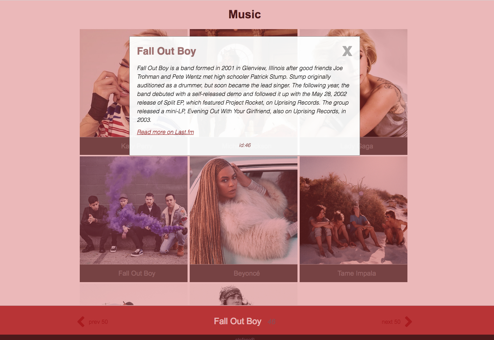

# musicApp
> (in progress)

- extracting music data from a public api
- so far i got a few modules 
    + [getallartists.js] main script api call
    + [apikey.js] another one to extract key -  i got mine at last.fm with a free account.
    + [artists.js] creates artist constructor, prototype functions and displays data on page -
    + [popupinfo.js] click event data popup -
    + [artistinfo.js] second api call request to gather bio summary for click click event popup -

 
<kbd>sample image</kbd>
 

 
