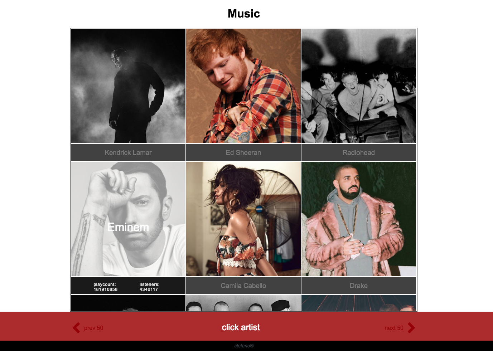

# musicApp
> (in progress)

- extracting music data from a public api
- so far i got 2 modules
    + [apicall.js] main script api call
    + [key.js] another one to extract key
    + [key.js] not actual key - i got mine at last.fm with a free account.

 
<kbd>sample image</kbd>
 

 
