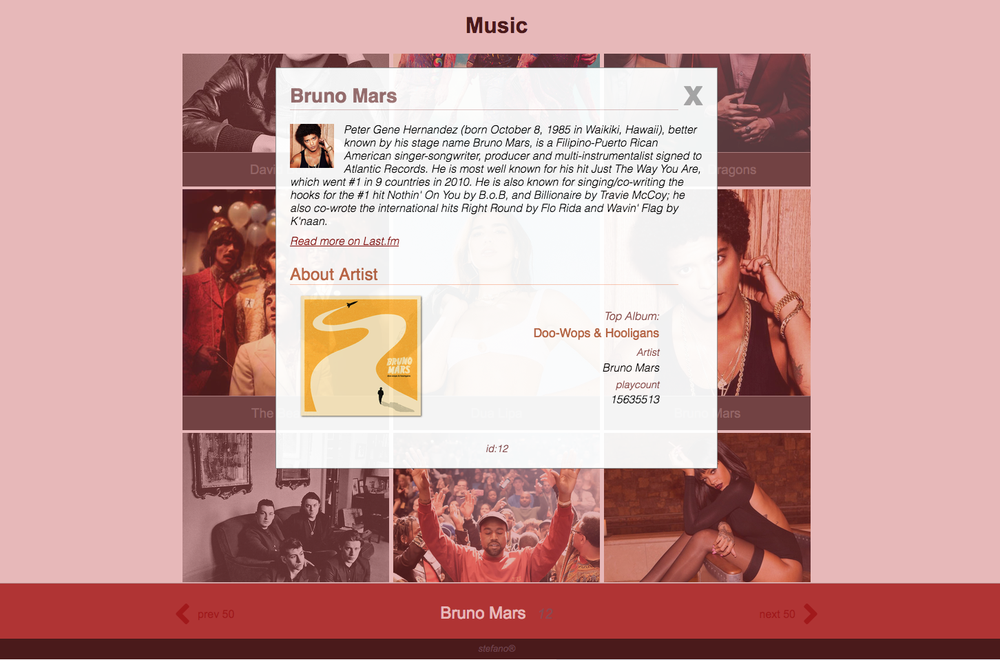
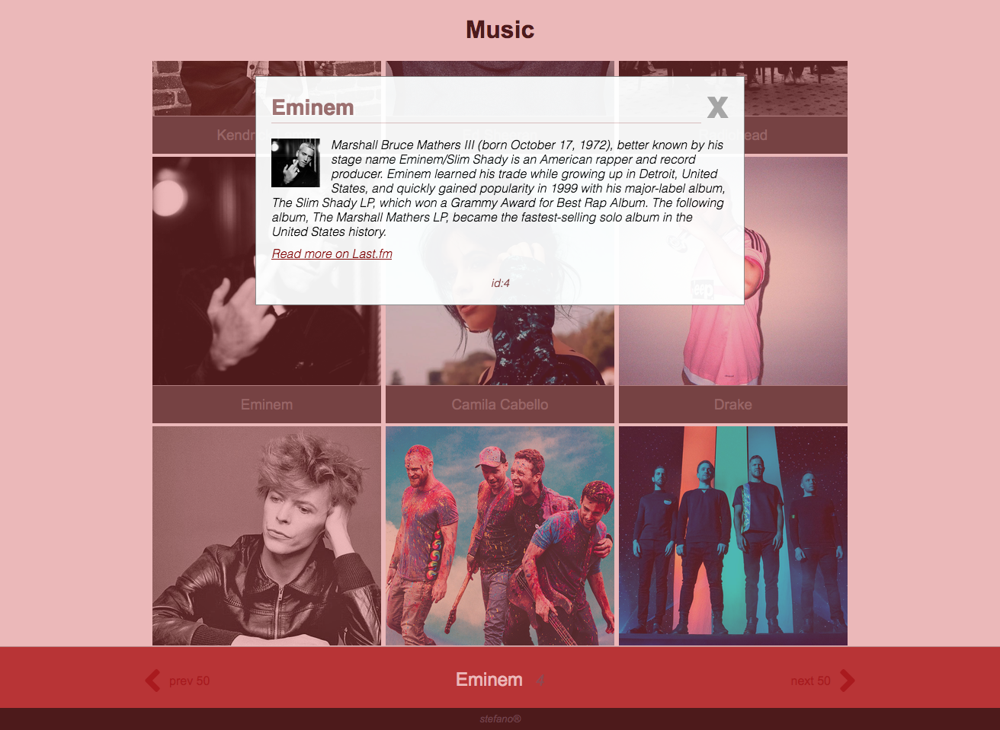

# musicApp
> (in progress)

- extracting music data from a public api
- so far i got a few modules 
    + [getallartists.js] main script api call
    + [apikey.js] another one to extract key -  i got mine at last.fm with a free account.
    + [artists.js] creates artist constructor, prototype functions and displays data on page -
    + [popupinfo.js] click event data popup -
    + [artistinfo.js] second api call request to gather bio summary for click click event popup -
    + [artistinfo.js] removed artist album information from here and created artistalbum.js to handle just album info
    + [artistinfo.js] artistinfo.js used to upload information to the page, once album information was collected.
    + [artistinfo.js] now it passes the artist info to artistalbum.js
    + [artistalbum.js] handles third request about album information, and brings it into the page along with artist info.
    + [artistalbum.js] created a 'click for more' button inside popup, where i'll be showing more information about the
    + [artistalbum.js] artist/album (like a popup inside a popup).

 
<kbd>latest screenshot</kbd>
 

 

 
<kbd>sample image</kbd>
 

 

> `b_*.js` pages are old versions of same pages without `b_`
